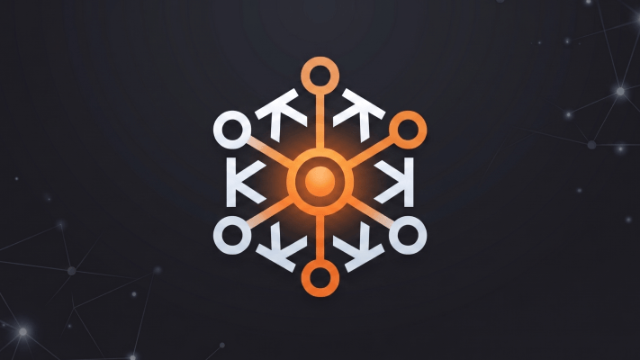

<p align="center">
  
</p>

# Forge

An end-to-end workflow for complex coding tasks. Forge turns vague requests into verified changes through discovery, planning, delegated execution, and review.

The goal: prevent the most expensive mistake in software — building the wrong thing, or building the right thing badly. Discovery costs minutes; rework costs hours.

Forge orchestrates sub-agents so the main context is almost never filled — each noisy step (code reading, planning, building, verification, review) runs in a fresh sub-agent with its own context window. What comes back is a concise synthesis, not a wall of tool output. In practice that means:

- **Longer tasks without running out of context** — the expensive reads and multi-file edits live in sub-agents that you throw away after each step.
- **Cleaner main conversation** — you see decisions and summaries, not `grep` output and `tsc` logs.
- **Better decisions** — each sub-agent is prompted for one narrow job, so it stays focused instead of drifting.
- **Parallel work when it's safe** — independent sub-agents run concurrently, which is only possible because they don't share context.

## How to Use

Use the `forge` skill by asking it for the thing you want to build:

```text
/forge Add a rate limiter to the public API.
```

Forge will take it from there — starting with a discovery conversation, then planning, then execution, with explicit checkpoints along the way.

**The discovery conversation is where the real value lives.** Don't rush through it — treat it as a collaborator thinking out loud, not a form to fill in.

## Lifecycle

```
DISCOVERY → APPROVE → RESEARCH → PLAN → [RECONFIRM*] → EXECUTION → VERIFY → [REFACTOR → RE-VERIFY]
```

*\* Reconfirm only fires when the plan deviates from the approved approach. If it tracks, Forge skips straight to execution instead of asking for another rubber-stamp.*

Refactor runs only after a green Verify and skips docs, config, generated output, and trivial mechanical diffs. If it changes code, Forge runs the full verification team once more; if it skips, the task is already done.

For small, unambiguous tasks Forge declares a **light** tier at Approve: the approved approach doubles as the plan, so Research, Plan, and Refactor are skipped while Verify runs in full. Anything that breaks those assumptions mid-flight upgrades the task back to the full lifecycle.

## Sub-agents

Forge coordinates a team of specialized agents:

- **strategist** — turns goals into sequenced roadmaps
- **analyst** — investigates how the code works, and root-causes failures
- **builder** — builds the solution
- **refactorer** — simplifies verified changes without altering behavior
- **validator** — validates against acceptance criteria with evidence
- **reviewer** — checks code quality
- **auditor** — security audit for sensitive surfaces (runs in parallel with reviewer)

## Installation

**Note:** Installation differs by platform. Claude Code and Codex use plugin marketplaces. Cursor marketplace approval is still pending.

### Claude Code (via Plugin Marketplace)

In Claude Code, register the marketplace first:

```bash
/plugin marketplace add mariomka/forge
```

Then install the plugin from this marketplace:

```bash
/plugin install forge@forge-marketplace
```

### Codex (via Plugin Marketplace)

Register the marketplace, then install Forge:

```bash
codex plugin marketplace add mariomka/forge
codex plugin add forge@forge-marketplace
```

Restart Codex and open a new conversation so it loads the plugin.

### Cursor

> **Note:** The Cursor marketplace listing is pending approval. In the meantime, tell Cursor:
>
> ```
> Fetch and follow instructions from https://raw.githubusercontent.com/mariomka/forge/main/.cursor-plugin/INSTALL.md
> ```

Once the marketplace listing is approved, install from Cursor Agent chat:

```text
/add-plugin forge
```

Or search for "forge" in the plugin marketplace.

### Other harnesses

Forge works with any harness that can load local skills and agent definitions — point its loader at `skills/` and `agents/` in this repo. If you've wired up OpenCode, Gemini CLI, Copilot CLI, or another harness and want to contribute the integration, PRs welcome.
